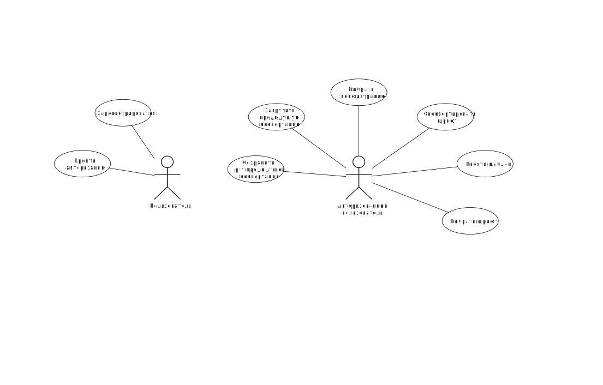
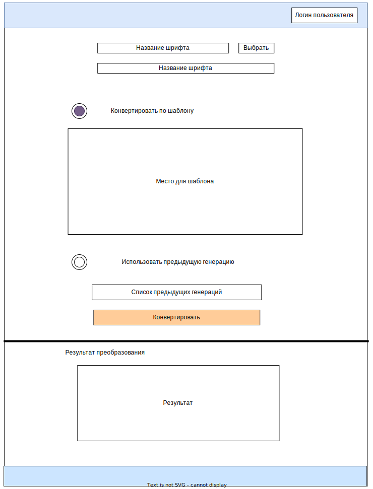
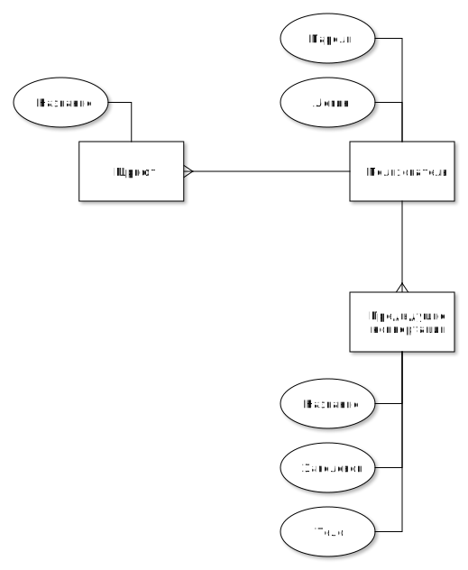

## Решаемая проблема
Конвертация шрифта из формата TrueType в формат библиотеки PEG (Portable Embedded GUI)

## Функциональные требования
- настройка выходного представления глифов: величина отступа, порядок байтов, формат комментариев

## Use-case диаграмма

## Черновые эскизы экранов приложения

## ER-диаграмма сущностей системы
 
