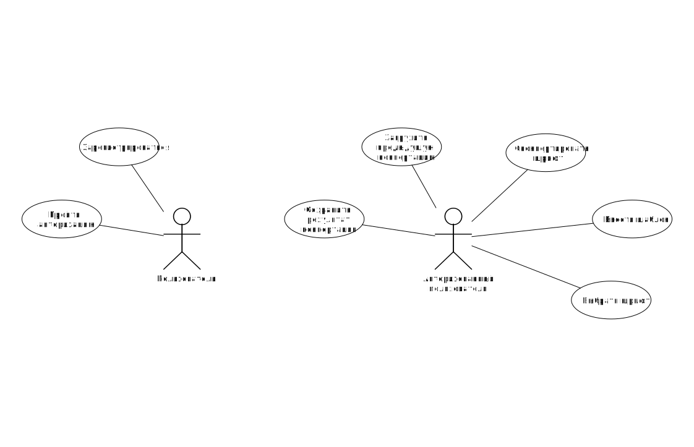

## Решаемая проблема
Конвертация шрифта из строки символов в формат библиотеки PEG (Portable Embedded GUI)

## Функциональные требования
- настройка выходного представления глифов: величина отступа, порядок байтов, формат комментариев

## Use-case диаграмма

## Черновые эскизы экранов приложения

## ER-диаграмма сущностей системы
 

## Портрет пользователя
* зумер, 15 лет
* тратит много времени на просмотр стримов
* у пользователя нет желания разрабатывать свое решение
* пользователь не желает скачивать и устанавливать приложение на компьютер

## Сценарии использования
1) Регистрация
2) Авторизация
3) Первая конвертация шрифта в PEG
	- настройка конфигурации или выбор существущей
	- выбор доступного шрифта
	- ввод символов (наблона)
	- копирование результата конвертации
4) Выбор ранее произведенной конвертации
	- выбор существующей конвертации
	- копирование результата конвертации
	