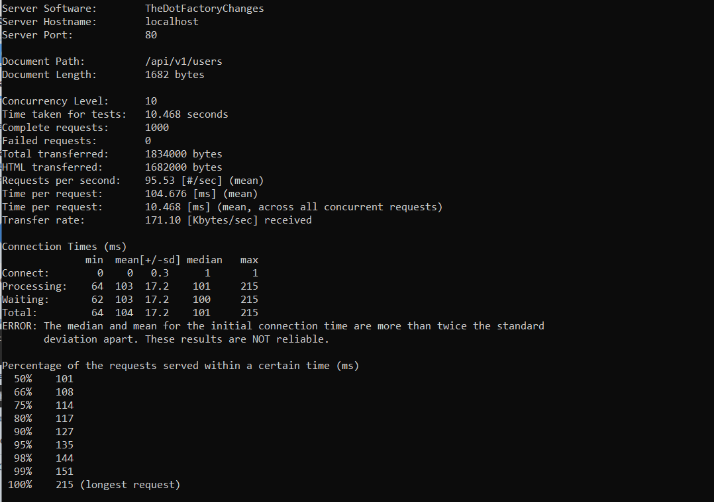
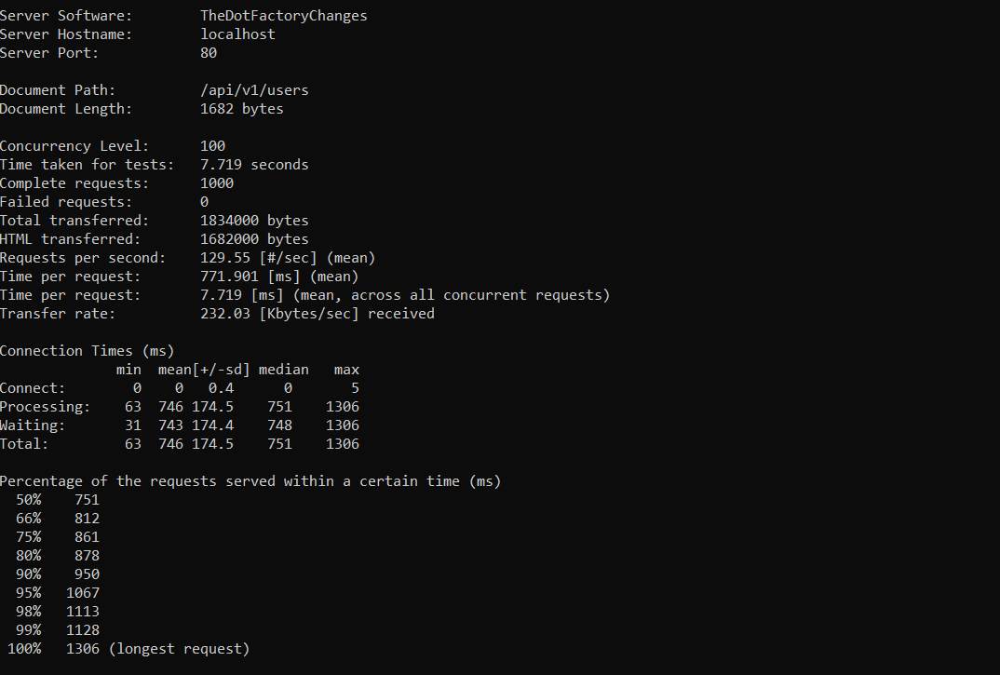
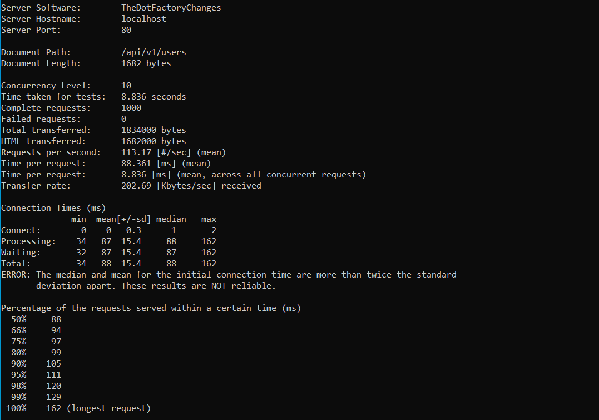
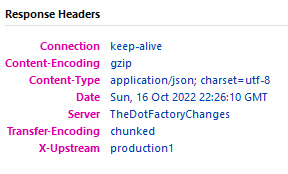
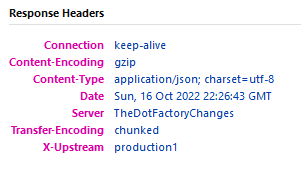
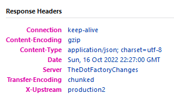
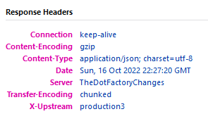
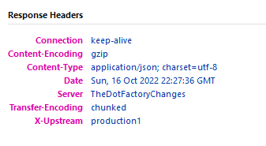

Проведение "нагрузочного" тестирования:

Сбор данных выполнялся следующим образом:
- Для каждой конфигурации (с 1 и 3 проксируемыми серверами)
 тест запускался для значений (10, 1000), (100, 1000) и (100, 10000),
 где первое значение в скобках --- количество одновременных соединений, 
 а второе --- общее количество запросов

Ниже приведены результаты тестирования:

1) Запущен один проксируемый сервер:

2) Запущено три проксируемых сервера:

Для доказательства работы балансирования в заголовок http-ответа добавлено поле
X-Upstream, содержащее указание на проксируемый сервер:
production1, production2 или production3

После отправки пяти запросов получим следующий результат:

Как видим, первый хост получил два запроса, потом остальные по одному.
Затем цикл повторяется.
